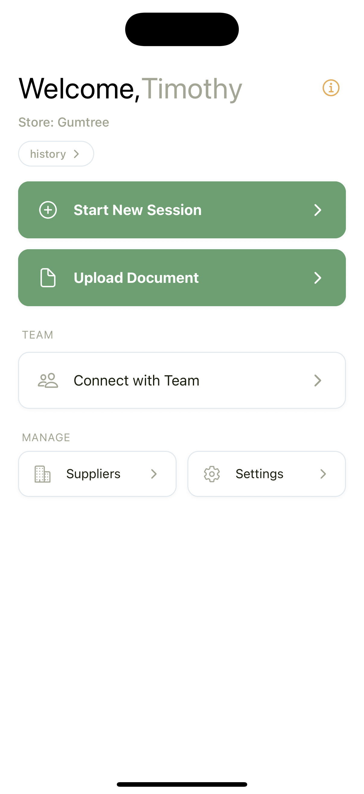
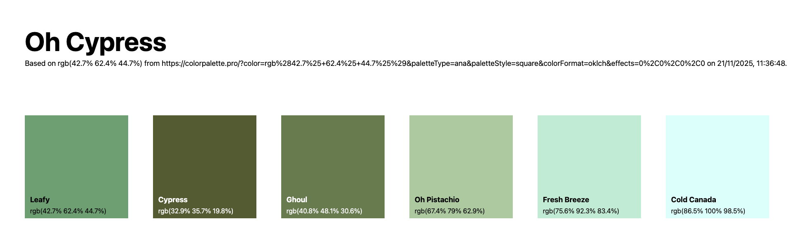

# Restock App 2.0 (MVP)

A Clean, Offline-First Rebuild of the Restock Application (╯°□°）╯︵ ┻━┻

This MVP rebuild focuses on the core value: helping small retailers restock efficiently through a simple **Walk → Log → Send** workflow.

<table>
  <tr>
    <td align="center"></td>
    <td align="center"></td>
  </tr>
</table>

We discarded the bloated hexagonal architecture, cloud databases, and complex auth flows of v1 in favor of a **Client-Heavy, Serverless-Light** approach.

---

## 🚀 Key Features

- **Offline-First**: All data lives on your device. No login required. No cloud sync. Your inventory, your device.
- **Image-Only Parsing**: Snap a photo of a clipboard or invoice. Llama 4 Maverick extracts the items instantly.
- **Professional Emails**: Sends branded HTML emails with tables and logos via Resend.
- **Zero Latency**: No database round-trips for UI interactions. Everything feels instant.
- **Supplier Grouping**: Items automatically grouped by supplier for streamlined ordering.
- **Connect with Team**: Create or join a company to share suppliers and coordinate restocking across your team.

---

## 🏗️ Architecture

### Frontend (Expo / React Native)
- Expo (Managed → Prebuild) with file-based routing via Expo Router
- Zustand for global state (Sessions, Suppliers, Profile)
- Custom theme tokens (Forest Green / Cream palette)
- AsyncStorage for persistence

### Backend (Cloudflare Workers)
Two stateless endpoints—no databases, no state, just functions:
- **`/parse-doc`**: Accepts images, runs Groq Vision (Llama 4 Maverick) for OCR, returns structured JSON
- **`/send-email`**: Generates professional HTML templates, sends via Resend API

---

## 🔄 User Flows

### 1. Onboarding
Full-screen immersive welcome slider. Enter your name and store once. Saved locally. Instant access to dashboard.

### 2. Document Upload
Take a photo of your stock sheet. The Cloudflare Worker extracts text and returns structured JSON. Review and select items to import into your session.

### 3. Emailing
Items are automatically grouped by supplier. Preview your drafts. Emails sent from `noreply@restockapp.email` with `Reply-To` set to you.

---

## 🛑 Pivots & Lessons Learned

1. **PDF vs Images**: Parsing PDFs on the edge is a nightmare. Users prefer taking photos of clipboards anyway. We optimized for images and never looked back.

2. **Auth vs Local**: Small business owners don't want another password. Local-first removes 90% of the friction. The "just works" factor is worth more than cloud sync.

3. **Model Selection**: Llama 3.2 hallucinated products that didn't exist. Llama 4 Maverick (128-expert MoE) is precise enough for inventory lists without the creative fiction.

4. **Hexagonal Architecture Was Overkill**: Ports, adapters, dependency injection—all of it added complexity without value for a mobile app this size. Direct imports and Zustand stores are simpler and faster to iterate on.

5. **Serverless-Light Wins**: Two Cloudflare Workers handle everything the backend needs. No database migrations, no connection pooling, no cold start headaches. Just functions.

6. **Camera > File Picker**: Native camera flows are more reliable than file pickers across devices. We leaned into the constraint and the UX improved.

---

*(Old v1 architecture with Clerk/Supabase/Hexagonal/DI is officially retired in favor of this shipping product.)*
