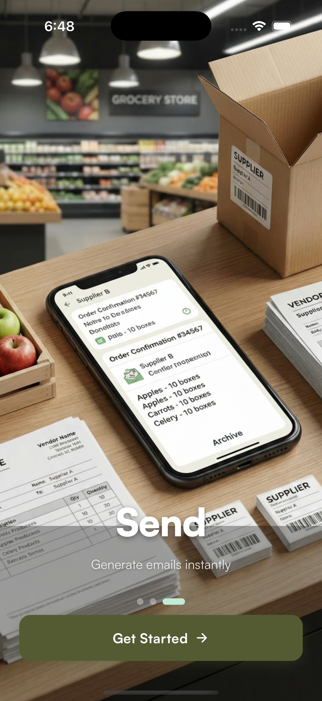

# Restock App 2.0 (MVP)

A Clean, Offline-First Rebuild of the Restock Application (╯°□°）╯︵ ┻━┻


This MVP rebuild focuses on the core value: helping small retailers restock efficiently through a simple **Walk → Log → Send** workflow.





We discarded the bloated hexagonal architecture, cloud databases, and complex auth flows of v1 in favor of a **Client-Heavy, Serverless-Light** approach.

---

## 🚀 Key Features

- **Offline-First**: All data lives on your device (AsyncStorage + Zustand). No login required.
- **Image-Only Parsing**: Snap a photo of a clipboard or invoice. Llama 4 Maverick extracts the items instantly.
- **Professional Emails**: Sends branded HTML emails with tables and logos via Resend.
- **Zero Latency**: No database round-trips for UI interactions.

---

## 🏗️ Architecture

### Frontend (Expo / React Native)
- **Framework**: Expo (Managed -> Prebuild).
- **State**: `Zustand` for global state (Sessions, Suppliers, Profile).
- **Navigation**: `Expo Router` (File-based).
- **Styling**: Custom theme tokens (Forest Green / Cream palette).

### Backend (Cloudflare Workers)
Two stateless endpoints:
1. **`/parse-doc`**:
   - Accepts `multipart/form-data` (Images).
   - Uses **Groq Vision (Llama 4 Maverick)** for high-accuracy OCR.
   - Returns structured JSON: `{ items: [{ product, quantity, supplier }] }`.
2. **`/send-email`**:
   - Accepts JSON payload.
   - Generates professional HTML templates (Tables, Logo, Banner).
   - Sends via **Resend API**.

---

## 🔄 User Flows

### 1. Onboarding (The "Cold Start")
- **Welcome**: Full-screen immersive slider.
- **Setup**: Enter Name/Store once. Saved locally.
- **Result**: Instant access to Dashboard.

### 2. Document Upload (The "Magic" Flow)
- **Action**: Take photo of stock sheet.
- **Process**: Cloudflare Worker extracts text -> JSON.
- **Review**: User selects items -> Imports to Session.
- **Pivot**: We dropped PDF support to ensure 100% reliability with native camera flows.

### 3. Emailing
- **Grouping**: Items automatically grouped by Supplier.
- **Preview**: Review drafts before sending.
- **Delivery**: Emails sent from `noreply@restockapp.email` with `Reply-To` set to the user.

---

## 🛠️ Development

### Prerequisites
- Node.js & npm
- Expo CLI
- Cloudflare Wrangler (for backend)

### Commands
```bash
# Frontend
cd restock
npm install
npx expo start --clear

# Backend (Parse Worker)
cd backend/parse-doc
npm install
wrangler dev

# Backend (Email Worker)
cd backend/send-email
npm install
wrangler dev
```

### Running Tests
```bash
cd restock
npm run test
```

---

## 📦 Data Model (Local)

**Session**:
```ts
{
  id: string;
  createdAt: number;
  items: SessionItem[];
  status: 'active' | 'pendingEmails' | 'completed' | 'cancelled';
}
```

**SessionItem**:
```ts
{
  id: string;
  productName: string;
  quantity: number;
  supplierId?: string; // Auto-grouped
}
```

---

## 🛑 Pivots & Lessons Learned

1.  **PDF vs Images**: Parsing PDFs on the edge is hard. Users prefer taking photos of clipboards anyway. We optimized for **Images**.
2.  **Auth vs Local**: Small business owners don't want another password. Local-first removes 90% of the friction.
3.  **Model Selection**: Llama 3.2 hallucinated products. **Llama 4 Maverick** (128-expert MoE) is precise enough for inventory lists.

---

*(Old v1 architecture with Clerk/Supabase/Hexagonal/DI is officially retired in favor of this shipping product.)*
