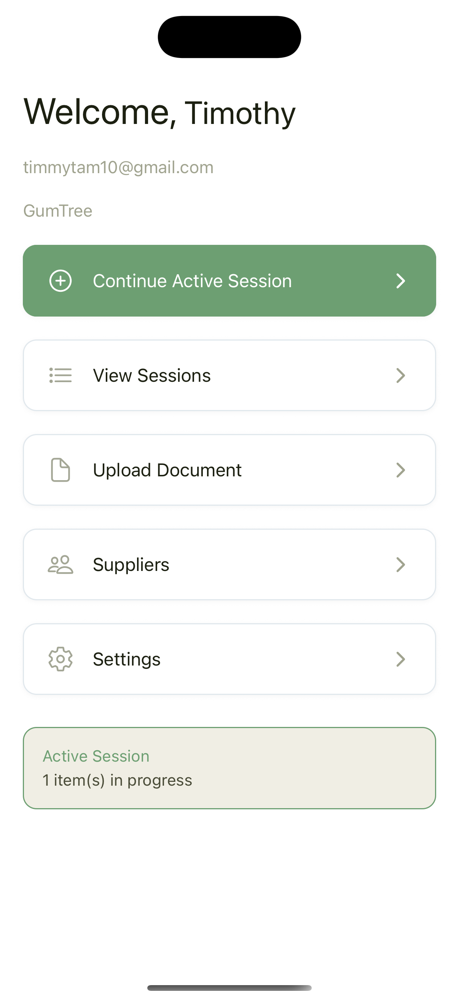

# restock-app-2.0
scaled down version of restock app
# Restock MVP

A Clean Rebuild of the Restock Application (╯°□°）╯︵ ┻━┻

 

This document introduces the new, simplified Restock architecture and explains why the previous project was retired. The original repository had grown into a large, complex system far beyond the needs of the real workflow. This MVP rebuild focuses on the core value: helping small retailers restock efficiently through a simple **Walk → Log → Send** workflow.

The original ReadMe outlined an ambitious multi-layer hexagonal architecture with Clerk authentication, Supabase persistence, dependency injection, RLS, OAuth flows, DI-driven React hooks, domain-driven entities, and a full stack of backend services.
While technically impressive (and sometimes heroic), that system became fragile, difficult to debug, and nearly impossible to ship. (ಠ_ಠ)

This new version is intentionally minimal, maintainable, and practical.
It discards everything that created instability in the previous codebase and focuses solely on the features that deliver real value to store owners.

All state is fully local.
All complexity is reduced.
Only two serverless functions remain.

Below is the complete, updated MVP specification.

---

# Why This Rebuild Was Necessary

### Problems Identified in the Original Project (from the previous ReadMe)

The earlier architecture used:

* Clerk for multi-provider authentication
* Supabase for real-time synced data
* A 6-table relational schema
* Fully implemented hexagonal architecture (Domain → Application → Infrastructure → UI)
* Dependency injection container
* Edge functions
* Custom AI email generation layer
* 80+ domain tests
* Production security (RLS, JWT bridging, audit logs, retries, etc.)

These components introduced several issues:

* **High architectural weight** for a mobile-first MVP
* **Multiple external services** required to be healthy simultaneously
* **Auth and DB failures** blocked basic screens (user couldn’t even open the app offline)
* **Excessive boilerplate** caused long development cycles
* **Difficult debugging** due to DI layers, abstracted repositories, and mapped domain entities
* **Unnecessary complexity** for a tool meant for single-device use by small retailers

Although the original build demonstrated strong engineering ability, it no longer aligned with the real-world usage of the app.

The target users—store owners doing weekly restocks—do not need:

* Cloud sync
* User accounts
* OAuth
* Real-time data
* RLS policies
* Edge database logic

The rebuild removes everything that wasn’t contributing directly to restocking tasks.

---

# What Changed in This New Version (￣︶￣;)

### The new Restock MVP:

* Has **no authentication**
* Has **no remote database**
* Stores everything **locally on device**
* Uses **only two serverless endpoints**

  * One for AI document parsing
  * One for email delivery
* Removes Clerk, Supabase, OAuth, DI, RLS, and all associated plumbing
* Eliminates the hexagonal architecture overhead
* Uses simple Zustand stores instead of repository abstractions
* Uses a clear Expo Router project structure
* Matches the actual workflow in kitchens, delis, and grocery stores
* Ensures offline-first reliability
* Ships faster, breaks less, and is maintainable by a single developer

This rebuild takes everything learned from the original project and applies it to a workflow-first, user-centered design.

---

# Screen Map & User Flow

All persistent data is stored locally. Only document parsing and email sending use serverless endpoints.

---

## 1. App Entry

### 1.1 Splash

* Shows logo
* Loads local stores (sender profile, suppliers, sessions, products)

### 1.2 Onboarding

Shown once:

* Welcome
* Explanation of Restock
* Continue

### 1.3 Sender Setup

Form fields:

* Name
* Email
* Optional store name
  Saved locally and editable later.

---

## 2. Dashboard

Contains:

* Start New Restock Session
* Recent Sessions
* Suppliers
* Settings

This reflects the original UX but without any authentication requirements.

---

## 3. Restock Session Flow

### 3.1 Start Session

Creates a session:

```
{
  id,
  createdAt,
  items: [],
  status: "active"
}
```

### 3.2 Session Menu

Entry points:

* Add Product Manually
* Upload Supplier Document (AI parser)
* View Current Items

Also displays totals and supplier summaries.

---

## 3.3 Add Product (Manual)

Includes:

* Product name
* Quantity
* Supplier picker (optional)
* Category (optional)

---

## 3.4 Upload Supplier Document

### Document Upload

* Accepts PDF or image
* Sends file to `/parse-doc`
* Receives structured product list

### Review Screen

Users confirm or adjust:

* Product names
* Quantities
* Supplier assignment
* Categories

Approved items are added to the session.

---

## 3.5 Session Items Screen

Displays:

```
Category
  - Product
  - Quantity
  - Supplier
  - Edit/Delete
```

Users can make bulk or individual changes and then finish the session.

---

## 4. Email Flow

### 4.1 Supplier Grouping

Groups items by supplier.
Users confirm suppliers and fill missing emails.

### 4.2 Email Preview

AI generates email bodies for each supplier.
Users can edit:

* Subject
* Body
* Reply-to
* Supplier email

Sending all emails completes the session.

---

## 5. Session History

### 5.1 Past Sessions List

Shows date, item count, status.

### 5.2 Session Detail

Includes items, suppliers, email text, and “Repeat Session.”

### 5.3 Repeat Session

Clones items into a new active session.

---

## 6. Suppliers Management

### 6.1 Suppliers List

Names, emails, and optional frequently used items.

### 6.2 Add/Edit Supplier

Manual or auto-generated from parsed documents.

---

## 7. Settings

Includes:

* Edit sender profile
* Clear all data
* Export JSON (debugging)
* About

No sign-in. No cloud sync. No external auth.

---

# User Flows

## Flow A: Manual Restock

1. Dashboard → Start Session
2. Add Product Manually
3. Add more items
4. Finish Session
5. Email Preview
6. Send Emails
7. Session saved locally

## Flow B: Document-Based Restock

1. Dashboard → Start Session
2. Upload Document
3. AI Parsing
4. Review Items
5. Finalize suppliers
6. Finish Session
7. Send Emails
8. Session saved locally

## Flow C: Repeat Session

1. Dashboard → Past Sessions
2. Select session
3. Repeat Session
4. Adjust quantities
5. Send

---

# Minimal Local Data Model

```ts
type SenderProfile = {
  name: string;
  email: string;
  storeName?: string;
};

type Supplier = {
  id: string;
  name: string;
  email?: string;
};

type Session = {
  id: string;
  createdAt: number;
  items: SessionItem[];
  status: "active" | "completed";
};

type SessionItem = {
  id: string;
  productName: string;
  quantity: number;
  supplierId?: string;
  category?: string;
};

type ProductHistory = {
  id: string;
  name: string;
  lastSupplierId?: string;
  lastQty?: number;
};
```

Everything persists locally via AsyncStorage.

---

# Serverless Endpoints Required

```
POST /parse-doc
  input: { file }
  output: { items: ParsedItem[] }

POST /send-email
  input: { supplierEmail, replyTo, items[] }
  output: { success: true }
```

These endpoints are stateless and replace the entire Supabase + Clerk + Edge functions architecture.

---

# MVP Summary (ノಠ益ಠ)ノ

This rebuild achieves the true goal of the project:

* Simple, stable, local-first
* Zero authentication overhead
* Zero cloud database dependencies
* Only two lightweight endpoints
* Architecture aligned with real-world user behavior
* Faster development, easier maintenance, and more reliable operation

